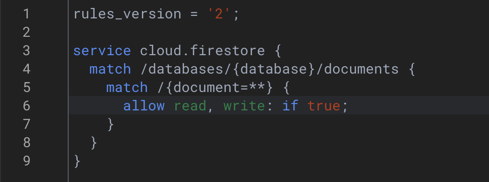

# [Main](https://github.com/wolf790206/crwn-clothing/tree/main)
-   [HTML View](https://wolf790206.github.io/crwn-clothing/dist/)
-   React + Vite
-   firebase

### [lesson1](https://github.com/wolf790206/crwn-clothing/tree/lesson1)

點我展開細節

**建立專案**

- 建立專案 `npm create vite@latest crwn-clothing -- --template react`
  - *crwn-clothing 可改為自己專案的名稱*
-  `App.jsx` 
  - 建立基本的HTML格式
---

### [lesson2](https://github.com/wolf790206/crwn-clothing/tree/lesson2)

點我展開細節

**簡化程式**

-  `App.jsx` 
  - 建立 `category` 物件
  - 嘗試使用 `map()` 的方式建立HTML
---

**補充概念**

- [Obj 物件](https://ithelp.ithome.com.tw/articles/10219496)
- [map()](https://ithelp.ithome.com.tw/articles/10215281)
---

### [lesson3](https://github.com/wolf790206/crwn-clothing/tree/lesson3)

點我展開細節

**使用樣式**

- 安裝套件 `npm install sass`
- 新增檔案 `category.styles.scss` 在 `src/`
- `category.styles.scss`
  - 建立樣式
- `App.jsx`
  - 匯入 `category.styles.scss`
---

**補充概念**

- [SCSS](https://ithelp.ithome.com.tw/m/articles/10190746)
---

### [lesson4](https://github.com/wolf790206/crwn-clothing/tree/lesson4)

點我展開細節

**拆分元件**

- `App.jsx`
  - 更新 `category` 物件，增加 key `imageUrl`
- 建立資料夾 `components/category-item`
- 新增檔案 `category-item.component.jsx` 在 `components/category-item`
- 新增檔案 `category-item.styles.scss` 在 `components/category-item`
- `App.jsx`
  - 剪下 `.category-container` className
  - 貼在 `category-item.component.jsx`
- `category.styles.scss`
  - 剪下 `.category-container` css
  - 貼在 `category-item.styles.scss`
- `category-item.component.jsx`
  - 匯入 `category-item.styles.scss`
- `App.jsx`
  - 匯入 `CategoryItem` 從 `category-item.component.jsx`
---

### [lesson5](https://github.com/wolf790206/crwn-clothing/tree/lesson5)

點我展開細節

**拆分元件**

- 建立資料夾 `src/components/directory`
- 新增檔案 `directory.component.jsx` 在 `components/directory`
- 新增檔案 `directory.styles.scss` 在 `components/directory`
- `App.jsx`
  - 剪下 `.categories-container` className
  - 貼在 `directory.component.jsx`
- `category.styles.scss`
  - 剪下 `.categories-container` css
  - 貼在 `directory.styles.scss`
  - 刪除 `category.styles.scss`
---

**路徑新增**

- `vite.config.js` 加入 `src`, `components`  路徑
- 新增檔案 `jsconfig.json` 在 `./` 根目錄中， 
- `jsconfig.json` 加入 `src`, `components` 路徑
---

### [lesson6](https://github.com/wolf790206/crwn-clothing/tree/lesson6)

點我展開細節

**字體使用**

- 確認使用的字體[Google Fonts](https://fonts.google.com/)
- `index.html`
  - 匯入 `google fonts` link
- `index.css` 更名 `index.scss`
  - 增加 `font-family` 樣式
- `main.jsx`
  - 匯入 `index.scss`

### [lesson7](https://github.com/wolf790206/crwn-clothing/tree/lesson7)

點我展開細節
 

**路由設定**

- 安裝套件 `npm install react-router@7`
- `main.jsx`
  - 匯入 `BrowserRouter` 從 `react-router`
  - 使用 `BrowserRouter` 包覆 `<App />`
- 建立資料夾 `src/routers/home`
- 新增檔案 `home.component.jsx` 在 `routers/home`
- `App.jsx`
  - 剪下 `App` 所有程式碼
  - 貼在 `home.component.jsx`
- `home.component.jsx`
  - `App` 更名為 `Home`
- `App.jsx`
  - 匯入 `Home` 從 `home.component.jsx`
  - 匯入 `Route`, `Routes` 從 `react-router`
  - 增加 `<Home />` 的 `Route`
---

**路徑新增**

- `vite.config.js` 加入 `rouers` 路徑
- `jsconfig.json` 加入 `rouers` 路徑
---

### [lesson8](https://github.com/wolf790206/crwn-clothing/tree/lesson8)

點我展開細節
 

**路由設定**

- `App.jsx`
  - 匯入 `Outlet` 從 `react-router`
  - 建立 `Navigation`, `Shop` arrow function
  - 增加 `<Navigation />`, `<Shop />` 的 `Route`
---

### [lesson9](https://github.com/wolf790206/crwn-clothing/tree/lesson9)

點我展開細節

**拆分元件**

- 建立資料夾 `src/routers/navigation`
- 新增檔案 `navigation.component.jsx` 在 `routers/navigation`
- `App.jsx`
  - 剪下 `Navigation`
  - 貼在 `navigation.component.jsx`
- `navigation.component.jsx`
  - 匯入 `Outlet`, `Link` 從 `react-router`
  - 匯入 `Fragment` 從 `react`
  - 使用 `<Link />` 增加 `home`, `shop` 路徑
- `App.jsx`
  - 移除 `Outlet`
  - 匯入 `Navigation` 從 `Navigation.component.jsx`
---

### [lesson10](https://github.com/wolf790206/crwn-clothing/tree/lesson10)

點我展開細節

**SVG設定**

- 安裝套件 `npm install vite-plugin-svgr`
  - [how to use](https://medium.com/@lisalisa12332180/%E4%BD%BF%E7%94%A8svgr%E5%9C%A8vite-react-typescript%E5%B0%88%E6%A1%88%E4%B8%AD%E5%BC%95%E5%85%A5svg%E5%9C%96%E6%AA%94-9634c2362dc6)
- `vite.config.js`
  - 匯入 `svgr` 從 `vite-plugin-svgr`
  - `plugin` 增加 `svgr()`
- `jsconfig.json`
  - 增加 `"types": ["vite-plugin-svgr/client"]`
---

**樣式設定**

- 建立資料夾 `src/assets`
- 新增檔案 `crown.svg` 在 `assets`
- `navigation.component.jsx`
  - 匯入 `CrownLogo` 從 `crown.svg` *寫法請特別注意*
  - 
- 新增檔案 `navigation.styles.css` 在 `routers/navigation`
- `navigation.styles.css`
  - 增加樣式
- `navigation.component.jsx`
  - 匯入 `navigation.styles.css`
  - 使用 `<Link />` 增加 `CrownLogo` 路徑
- `index.scss`
  - 增加 `*`, `a` 的樣式設定
---

**路徑新增**

- `vite.config.js` 加入 `assets` 路徑
- `jsconfig.json` 加入 `assets` 路徑
---

### [lesson11](https://github.com/wolf790206/crwn-clothing/tree/lesson11)

點我展開細節

**安裝與初始化 Firebase**

- 安裝套件 `npm install firebase`
- 建立資料夾 `src/routers/sign-in`
- 新增檔案 `sign-in.component.jsx` 在 `routers/sign-in`
---

**加入 Firebase 專案設定**

- 建立資料夾 `src/utils/firebase`
- 新增檔案 `firebase.utils.js` 在 `src/utils/firebase`
-  `firebase.utils.js` 
  - 匯入 `initializeApp` 從 `firebase/app`
  - 匯入 `getAuth`, `signInWithRedirect`, `signInWithPopup`, `GoogleAuthProvider` 從 `firebase/auth`
  - 新增 `provider` 物件，設定自定義參數
  - 建立 `auth` 與 `signInWithGooglePopup` 函式
---

**建立 Firebase 帳號**

- [Firebase](https://firebase.google.com/)
- 登入 Firebase Console，點選「新增專案」
  - *不需要啟用 Google Analytics*
- 新增應用程式 → 選擇「Web」→ 填寫網頁名稱 
  - *不需要啟用 Hosting*
- 複製 `firebaseConfig` 並貼到 `firebase.utils.js`
---

**開啟 Firebase Authentication**

- 在 Firebase Console → 選擇左側選單「Authentication」
- 開啟「Google 登入」方式（Enable）
---

**專案整合流程**

- `App.jsx` 新增 `/sign-in` Route
- `navigation.component.jsx`
  - 使用 `<Link />` 增加 `sign-in` 路徑
- `sign-in.component.jsx`
  - 匯入 `signInWithGooglePopup` 從 `firebase.utils.js`
  - 建立 `logGoogleUser()` 
    - *需要注意async*
  - 加入測試 `console.log()`
---

**路徑新增**

- `vite.config.js` 加入 `utils` 路徑
- `jsconfig.json` 加入 `utils` 路徑
---

**補充概念**

- [什麼是 CRUD？](https://ithelp.ithome.com.tw/articles/10244492)
  - CRUD = Create / Read / Update / Delete，是資料處理的基本操作
- [Async Await](https://ithelp.ithome.com.tw/articles/10249787)
---

### [lesson12](https://github.com/wolf790206/crwn-clothing/tree/lesson12)

點我展開細節

**Firestore 設定**

- 在 Firebase Console → 選擇左側選單「Firestore Database」
- 選擇一個 server 的位置，可以選擇離自己國家越近的位置
- 進入「Rules」,將讀、寫設定成 true
  - 
  - 點擊「Publish」
---

**Firestore 會員建立**

-  `firebase.utils.js` 
  - 匯入 `getFirestore`, `doc`, `getDoc`, `setDoc` 從 `firebase/firestore`
  - 設定 `db = getFirestore()`
  - 建立 `createUserDocumentFromAuth` *建立會員資料*
    - 建立 `userDocRef` 使用 `doc(db, 'users', userAuth.uid)` 
      - *使用 doc() 函式從 Firestore 建立一個指向 'users' 的 collection、以使用者 uid 命名的文件路徑*
    - 取得該會員資料，建立 `userSnapshot` 使用 `getDoc(userDocRef)` 取得資料
      - *使用 getDoc() 非同步取得該文件內容*
    - `userSnapshot.exists()` 可以確認是否已有該會員
- `sign-in.component.jsx`
  - 匯入 `createUserDocumentFromAuth` 從 `firebase.utils.js`
  - 將登入的 `user` 資料傳入 `createUserDocumentFromAuth`
  - 建立 `userDocRef`，設定 await `createUserDocumentFromAuth` 
- `createUserDocumentFromAuth`
  - 如果會員不存在 `!userSnapshot.exists()`
    - 建立會員資料，使用 `setDoc(userDocRef, {要存入的資料放這})` 
  - 如果會員已建立或存在，回傳 `userDocRef`
---

**補充概念**

- [Firestore 的結構](https://www.letswrite.tw/cloud-firestore-init-v9/#%e5%af%ab%e5%85%a5%e8%b3%87%e6%96%99)
  - *Collections > Documents > Data*
- [Firestore Ref](https://firebase.google.com/docs/firestore/quickstart?hl=zh-tw)
---

